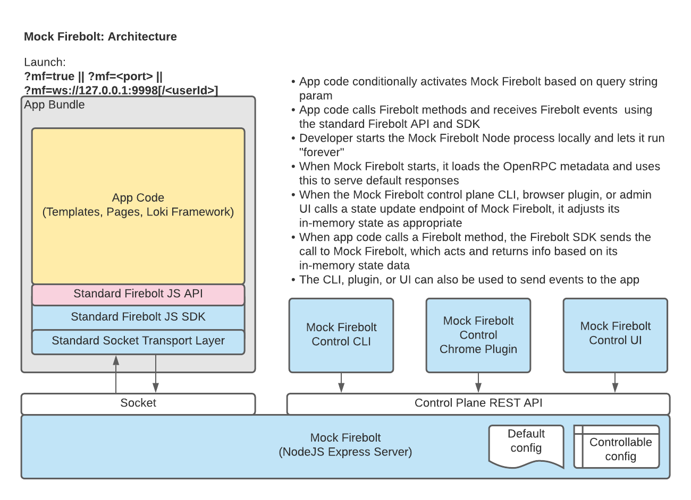

Mock Firebolt
=============

Mock Firebolt allows an app developer creating a Firebolt-compliant app to "artificially" cause calls to the Firebolt SDK(s) to return different responses than those returned by a real Firebolt running on whatever device(s) they may have.

This might be used, for example:

- by a developer who only has a STB to get Firebolt to answer as if it is a TV (or vice versa)
- to test variations of accessibility settings, advertising settings, etc.
- to test how the app responds to errors from the Firebolt SDK
- to test slow responses from the Firebolt SDK, etc.

FUTURE: Can act as a reverse proxy to a real Firebolt running on a real device.


# Goals:
- Enable app developers to be productive without needing a real device for as long as possible
- Enable app developers to force various responses from Firebolt to test an app "on" multiple devices, test edge cases, and simulate errors

(NOTE: The standard SDK has static mocks built in but it is *not* controllable or extensible.)

Note, too, that since the SDK does not validate parameters on method calls, app developers can also use Mock Firebolt as a way to validate that their invocations of Firebolt methods are correct.

# Features
- Controllable Mock Firebolt server (NodeJS websocket + HTTP server)
- Control mock method responses via control plane RESTful API, CLI, web admin UI (soon), browser extension (soon)
- 100% OpenRPC-driven; no SDK-specific details within the implementation
- Supports Firebolt SDKs: **core** (always), **manage** (optional), **discovery** (optional)
- Complete documentation
- Docker support
- Validation (based on OpenRPC specifications) of all parameters sent on method calls
- Validation (based on OpenRPC specifications) of all mock method override values
- Set multiple method overrides at once
- Command-line interface; especially helpful for loading all method overrides in a JSON or YAML file all at once ("import")
- CLI support for both JSON and YAML files
- Specify a method's response as either a non-error result or as an error
- Specify a method's response as a JavaScript function, which receives parameters passed to method call
- Share state between functions used to specify method responses
- Specify a sequence of responses (fail once, succeed once, etc.)
- Send events to the Firebolt SDK via the control plane (RESTful API, CLI, etc.)
- Send an event to multiple apps via the control plane (RESTful API, CLI, etc.)
- Send a timed sequence of events to the Firebolt SDK via the control plane (soon)
- Import/export for loading/saving mock response values 
- Magic date/time variable support (e.g., {{+1h|x}}, {{20:00|YYYY-MM-DD HH:mm:ssZ}})
- Set response latency per-method or globally
- Multi-user support (using paths on websocket URLs)
- Web admin UI to set mock responses (soon)
- Browser extension to send Firebolt lifecycle events
- Browser extension to set mock responses (some day)

# Architecture:




# Repo Contents

This repo contains these elements:

- **docs/**
  - [Documentation](./docs/Documentation.md)
- **server/**
  - A NodeJS server that acts as a mock Firebolt server
    - Responds to Firebolt SDK requests and sends events to the Firebolt SDK via the socket transport layer
    - Presents a RESTful interface for control tools (CLI, browser extensions, web admin app) to use
    - Presents an Express-based web administrative app, which can be used to affect the behavior of the mock Firebolt server
      - NOTE: **THE WEB ADMIN APP IS NOT FINISHED YET**.
- **cli/**
  - A command-line interface which can be used to affect the behavior of the mock Firebolt server
- **browser-extensions/**
  - Browser extensions which can be used to affect the behavior of the mock Firebolt server


# Documentation

See [Documentation](./docs/Documentation.md).


# SDK Support and the server/src/.mf.config.json File

Mock Firebolt is a very generic mocking service for almost *any* OpenRPC-based service. The list of particular SDKs the server supports when you run it is controlled by the contents of the `server/src/.mf.config.json` file and any associated command-line flags you provide when you start the server.

The repo contains a `server/src/.mf.config.SAMPLE.json` file and you'll need to copy this file to `server/src/.mf.config.json` in order for the server to start. Once you've done this, you're free to edit your `server/src/.mf.config.json` file and add other SDKs if you'd like. If the OpenRPC JSON file for your API is somewhere in the cloud or otherwise available via HTTP, you should use the `url` property for the SDK in this file rather than the `fileName` property (which is only used for SDKs for which there is a "hard dependency" in the `server/package.json` file).

The next two sections presume you are using the out-of-the-box `.mf.config.json` file.


# Firebolt SDK Support

Mock Firebolt supports these Firebolt SDKs: **core**, **manage**, **discovery**.

By default, only the core SDK is enabled, meaning if you try to make calls to methods in the other SDKs, Mock Firebolt will thow an error.

This default mode is appropriate for app developers developing third-party content apps that don't need (nor get) the permissions necessary to use the other SDKs.

For developers building "operator apps" / "search and discover apps" which need one or more of these SDKs, when running the Mock Firebolt server, you can pass flags like `--manage` and/or `--discovery` to enable the specific SDK(s) desired. Note of course that ultimately, when running on a real device, your app will only have whatever permissions it has been given.


# $badger Support

Mock Firebolt also supports the $badger SDK for application developers migrating from $badger to Firebolt.

Developers wishing to activate this functionality must pass the `--moneybadger` command-line flag when starting Mock Firebolt. As well, you must use the `activateMockFireboltForBadger.js` script within your app and have it execute *before* your app bundle (which includes $badger) executes.


# Important Dependency/Version Notes

**Mock Firebolt requires that your client app import minimal versions of the various Firebolt SDKs.**

| SDK                                 | Minimum Version |
| ----------------------------------- | --------------- |
| @firebolt-js/firebolt-sdk           | 0.6.0-alpha.1   |
| @firebolt-js/firebolt-manage-sdk    | 0.1.0-alpha.2   |
| @firebolt-js/firebolt-discovery-sdk | 0.1.0-alpha.1   |

These versions are the versions for each SDK when support for the socket transport layer and sensitivity to the global variable `window.__firebolt.endpoint` was added, both of which are required for the SDKs to work with Mock Firebolt.

If you use an older version of an SDK (e.g., 0.5.3 of the core SDK), no traffic will ever make it from the SDK to Mock Firebolt.


# Usage (Local)

Note: Requires NodeJS 16+. If you're using `nvm`, do `nvm use 16` or similar.

To install and run:

```
cd <the place you put your code repos>
git clone https://github.com/rdkcentral/mock-firebolt.git            /* THIS REPO */
cd mock-firebolt

# To start the mock Firebolt server (if running locally)
cd server

# One-time stuff

cp src/.mf.config.SAMPLE.json src/.mf.config.json

npm install
npm run clean             # Cleans/creates build/ subdirectory

npm run build:core        # MANDATORY: If you're only using the Firebolt Core SDK (typical for most 3rd party app devs)
npm run build:manage      # OPTIONAL: If you're using the Firebolt Manage SDK (not typical)
npm run build:discovery   # OPTIONAL: If you're using the Firebolt Discovery SDK (not typical)

npm run build:mf          # Builds source code within this project

# Ongoing stuff

# If this is not your first time using mock-firebolt but you want to ensure you have the latest SDK files you can use
npm run upgradeSDK

# If you're only using the Firebolt Core SDK (typical for most 3rd party app developers)
# Run in a separate terminal window/tab, or use '&' to background
npm run dev

# If you want support for the Firebolt Manage and/or Firebolt Discovery SDKs
# Include the flag(s) you require
# Note the extra double dash!
npm run dev -- --manage --discovery

# If you need to use non-standard ports for any reason:
npm run dev -- --httpPort 3456 --socketPort 9876

#If you wish to enable conduit functionality*
npm run dev -- --conduit

*Note*: Requires Conduit to be running. See the Conduit documentation (./conduit/README.md) for more information.

# If you need to use proxy connection for any reason:
npm run dev -- --proxy <ip>:<port>
Refer more about proxy mode in ./docs/ProxyMode.md

# To use the control CLI (assuming you're in the top-level directory for this repo)
cd cli
npm install
cd src
node cli.mjs --help

# FUTURE: To use the Chrome browser plugin
Visit chrome://extensions in Chrome
Ensure "Developer mode" is turned on (slider to the right in the top right corner of your browser window)
Click the "Load Unpacked" button (top left corner of browser window)
Navigate to the directory under browser-extensions which contains a manifest.json file and click "Select"
```

Now you can add `@firebolt-js/sdk` in your app's `package.json` file, import `@firebolt-js/sdk` in your code, and make calls using the Firebolt core SDK (or use the manage and/or discovery SDKs too). If you pass the appropriate query string parameter(s) (see [docs/UsageWithinApps.md](./docs/UsageWithinApps.md)), these SDK calls will get sent to the Mock Firebolt server and it will reply as you configure it to do so.

See the section "Important Dependency Notes" above for details about which versions of `@firebolt-js/sdk` (and other SDKs) support Mock Firebolt.


# Usage (via Docker, if you prefer)

NOTE: These instructions currently involve creating a docker image locally rather than downloading one from an image repository.

```
export MF_DOCKER_USER=<yourDockerUsername>

cd <top of repo>

# Create a docker image: Use the appropriate command (most 3rd party app devs should use the first command)
docker build -f Dockerfile.coreSdk . -t $MF_DOCKER_USER/mock-firebolt
docker build -f Dockerfile.allSdks . -t $MF_DOCKER_USER/mock-firebolt

# Confirm your image was created
docker images | grep mock-firebolt

# Run the image, enabling just the core SDK (typical)
# Change '$(pwd)' to whatever else you might want to use; this is where your MF .json files live
# NOTE: -p <outside/host port>:<inside/container port>
docker run -d \
  --name mf \
  --mount type=bind,source="$(pwd)",target=/usr/src/firebolt/host-files \
  -p 3333:3333 \
  -p 9998:9998 \
  $MF_DOCKER_USER/mock-firebolt

# Run the image, enabling the manage and discovery SDKs (in addition to the core SDK) (not typical)
docker run -d \
  --name mf \
  --mount type=bind,source="$(pwd)",target=/usr/src/firebolt/host-files \
  -p 3333:3333 \
  -p 9998:9998 \
  $MF_DOCKER_USER/mock-firebolt --manage --discovery

# Get container ID
docker ps | grep mf

# See logs
docker logs mf

# Enter the container (if necessary/desired)
docker exec -it mf /bin/bash

# Run CLI commands from inside the container (if necessary/desired)
container> cd /usr/src/firebolt/mock-firebolt/cli/src
container> node cli.mjs --help

# Run CLI
# Note the container path for the volume used when running the image is used here to refer to MF .json files
docker exec -it mf mf.sh --help
docker exec -it mf mf.sh --upload /usr/src/firebolt/host-files/<file relative current directory>
# E.g., docker exec -it mf mf.sh --upload /usr/src/firebolt/host-files/cli/examples/account-1.json

# Cleanup when done
docker stop mf
docker rm mf
docker image rm $MF_DOCKER_USER/mock-firebolt     (If you want to remove the image, too)
```


# Known Issues

See [Known Issues](./docs/KnownIssues.md).


# Contributing
If you would like to contribute code to this project you can do so through GitHub by forking the repository and sending a pull request.

Before RDK accepts your code into the project you must sign the RDK Contributor License Agreement (CLA).
