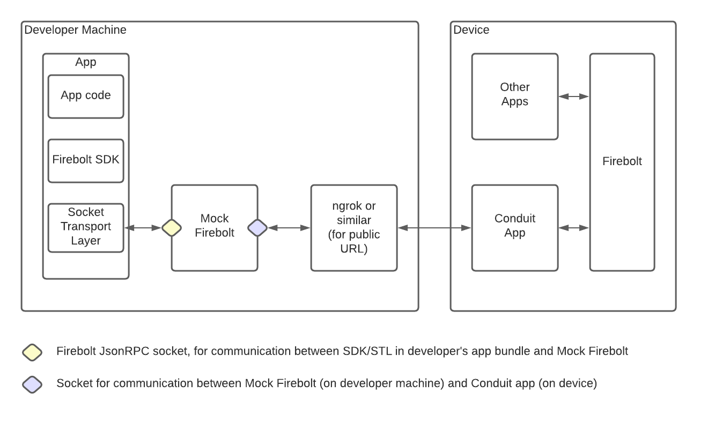
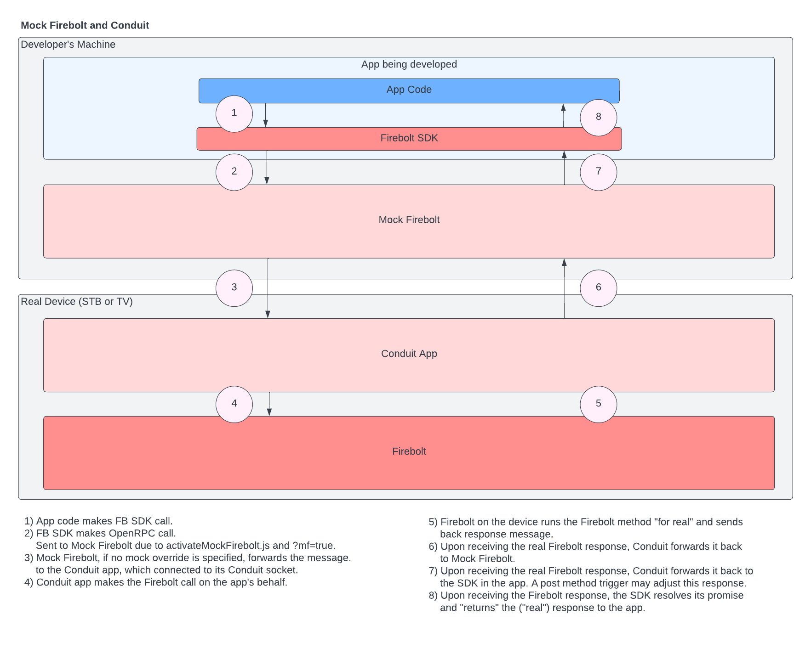
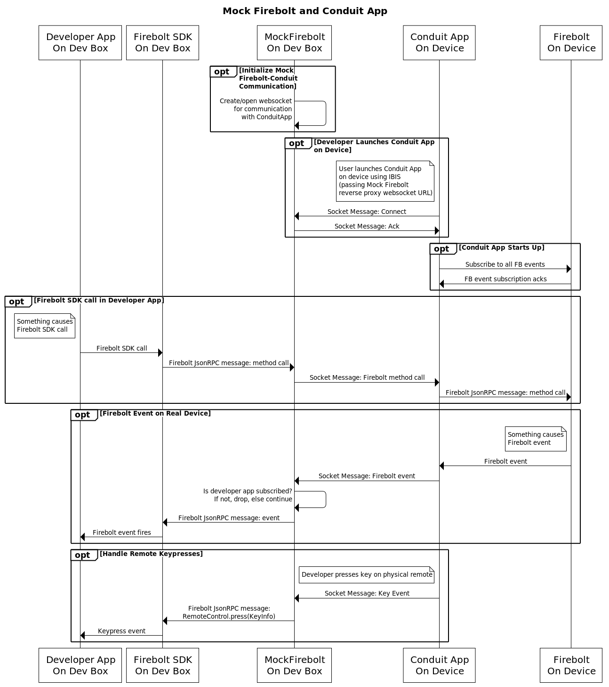

Mock Firebolt: Conduit
======================

# Goals

1. Developer develops and debugs locally, on his/her/their development machine

    - Fastest possible develop-debug cycle

    - No need to get RWI configured and working 

2. App interacts with a real Firebolt implementation on a real device (like magic!)

    - Done via Mock Firebolt on the developer’s machine and the Conduit app on the device
 
        - Firebolt calls from the app under development on the developer’s machine get sent to Mock Firebolt, which forwards them to the Conduit app on the device, which forwards them to the real Firebolt on the device. Responses flow in reverse. 

        - Firebolt events on the device get sent to the Conduit app (which subscribes to all Firebolt events), which forwards them to Mock Firebolt, which forwards them to the app under development (if listened to). 

# Why Conduit

Developers can run the Conduit app on their device and provide Mock Firebolt's host and port number when launching it via IBIS. Then, when their app (running locally, launched with ?mf=true or similar) makes Firebolt calls, Mock Firebolt will forward those calls to Conduit, which will ask Firebolt on the device to perform the method, and then return the response to Mock Firebolt, which will return it to the app. 
   
NOTE: This only happens if/when no mock override is specified for the method.

# How To Use

Follow these steps to get your app under development, Mock Firebolt, and Conduit to work together:

1. Start the Mock Firebolt server
2. Use Ibis to launch the Conduit app on your device (STB or TV).
  a. Provide a url parameter, mfc, whose value is the full web socket URL of the *Conduit* socket owned by Mock Firebolt. E.g., ws://(yourip#):9997
  b. If you want to use a separate Mock Firebolt with Conduit (not typical), you can also provide the typical 'mf' query parameter to connect Conduit to a second/separate Mock Firebolt. Here, you'll want to use something like mf=http://(yourip#):(portNumberOfSecondMockFirebolt) and start the second Mock Firebolt server so it listens on this port (using the --port command-line argume)
3. Start your app under development locally

NOTE: Be sure to start the Conduit app prior to starting your app under development. If you start your app before Conduit, your app will get mock responses from Mock Firebolt (because Mock Firebolt isn't yet connected to Conduit) until Conduit is launched. It's generally a good idea to hit refresh in your local browser for your app to ensure it is 'launching' after Conduit is up and running.

NOTE: Given that you are starting Conduit before your app, when your app starts up, it will not get forwarded "inactive" and "foreground" lifecycle events from Mock Firebolt (because Mock Firebolt couldn't forward them to your app when it received them (when it launched), because your app wasn't launched at that time). Instead, Mock Firebolt detects that your app was started up after the Conduit app and "artificially" sends these two events to your app. After that, any/all lifecycle events experienced by the Conduit app will be forwarded to your app as they occur within/to the Conduit app.

# System Overview 

Both the app under development and Mock Firebolt run on the developer’s machine. The Conduit app runs on a real device (set top box or TV), launched via IBIS. Critically, when the Conduit app is launched, the web socket URL for the Conduit socket in Mock Firebolt is passed as a query parameter. 

Another diagram:

# Sequence Diagram 

# Discussion 

The combination of Mock Firebolt on the developer’s machine and the Conduit app on the device (STB or TV) provides a “best of both worlds” solution to app developers, who want the fast develop-debug cycle of local development, but who need full/real integration with a real Firebolt implementation on a real device in order to properly interact with Firebolt (react to lifecycle events, etc.). Yet, 

  - It does take a certain amount of “rigging”... making sure the app being developed talks to Mock Firebolt, running Mock Firebolt, and launching the Conduit app on a device. 

  - This solution doesn’t ultimately address issues such as (a) performance considerations when running on a real device, (b) video player-related issues running on a real device, (c) metadata/content ingestion and VREX setup . 

As such, this combination of tools represents another phase/stage in the developer’s journey, after using Mock Firebolt and before testing on a real device.

# Technical Notes

## Chicken and the Egg Issue

As explained above, the Conduit app should be launched on a device prior to launching (refreshing) an app under development so that that app will receive real Firebolt responses from a real device (via the path Conduit->Mock Firebolt->App). But starting the app under development after the Conduit app is launched means that Conduit can't forward the "bootstrap" lifecycle events it receives when it starts to the app under development because that app isn't running yet.

As explained above, Mock Firebolt solves this problem by sending "inactive" and "foreground" events to the app under development once it connects to Mock Firebolt, if it connects to Mock Firebolt after Conduit is launched. This is done as follows:

-  When Mock Firebolt receives a Conduit socket connection from Conduit, Mock Firebolt sets a ts for when Conduit established its connection with Mock Firebolt

- When the local app connects to the JsonRPC Mock Firebolt socket, Mock Firebolt sets a ts for when the local app established its connection with Mock Firebolt

- If the local app connection ts > the Conduit connection ts, Mock Firebolt sends these bootstrap lifecycle events to the local app:

    - `{"from":"conduit","type":"FIREBOLT-LIFECYCLE-EVENT-FORWARD","userId":null,"data":{"moduleName":"lifecycle","eventName":"inactive","value":{"state":"inactive","previous":"initializing"}}}`

    - `{"from":"conduit","type":"FIREBOLT-LIFECYCLE-EVENT-FORWARD","userId":null,"data":{"moduleName":"lifecycle","eventName":"foreground","value":{"state":"foreground","previous":"inactive"}}}`
