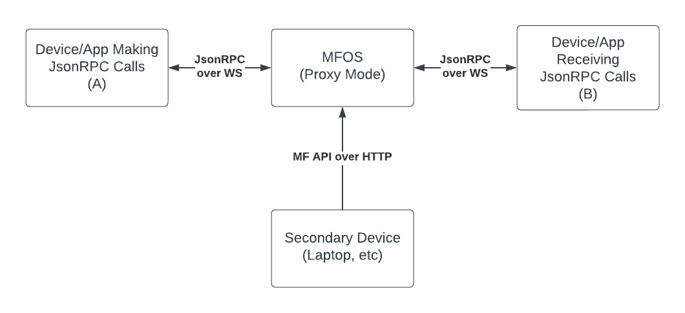

Mock Firebolt: Proxing request and response
===========================================

- [Overview](#overview)
- [Usage](#Usage)
- [Message Validation](#Validation)
- [Limitations](#Limitations)

# Overview

While Mock Firebolt was created to mimick/mock Json RPC repsonses there are many use cases involving manipulating real communication between endpoints.

Without any overrides or custom response logic set, the default behavior in MF is to return a response generated from an OpenRPC document. By replacing this OpenRPC logic with a proxy to a real endpoint we turn MF from a system of entirely canned responses to a full proxy with stubbing capabilities.



In the above diagram, system "A" establishes a connection to Mock Firebolt which then proxies that connection to system "B". As it always has, a 3rd party device controls the rules and overrides via the CLI and/or HTTP API

All existing override/response/error functionalities are present allowing a user to stub responses to A. However if a request contains no mock response, the call will be proxied to system B as opposed to generating a response from an OpenRPC document.

# Usage
To start Mock Firebolt with the proxy mode enabled:

```npm run dev -- --proxy 192.168.0.100:9998```*

Mock Firebolt will establish a websocket connection to the endpoint given as system B. Some systems may require an authentication token. To provide one for MF to use, you must `export` the token from your CLI before starting:

```export MF_TOKEN=<token>```

Mock Firebolt will detect this token and append it to the connection request as parameter `token`. Ex:

```ws://192.168.0.100:9998?token=<MF_TOKEN export>```

**Note: If the port is not provided in the forwarding URL, 9998 will be used as a default*

# Validation

By default, OpenRPC validations will still take place given the documents and SDKs provided to Mock Firebolt on startup. If you wish to use proxy mode for other JsonRPC communication, these validations should be disabled. For this reason, a ```--novalidate``` flag has been made available with 4 options:
* method - Do not perform validations on method names
* params - Do not perform validations on method parameters
* response - Do not perform validations on responses
* event - Do not perform validations on asynchornous events

These options can be used in any order/combination:

```--novalidate method --novalidate params --novalidate response --novalidate event```

# Limitations

Mock Firebolt has been developed to test A-to-B systems. It is expected that system A will establish communication with Mock Firebolt and system B will receive these calls and only occasionally send events back to system A. For this reason, most Mock Firebolt functionality regarding stubbing, repsonse overrides, etc is only available to system A.

Mock Firebolt was written for Json RPC communication with validations and responses generated using OpenRPC documentation. Mock Firebolt will not function properly if using/proxying messages not in a JSON RPC format.