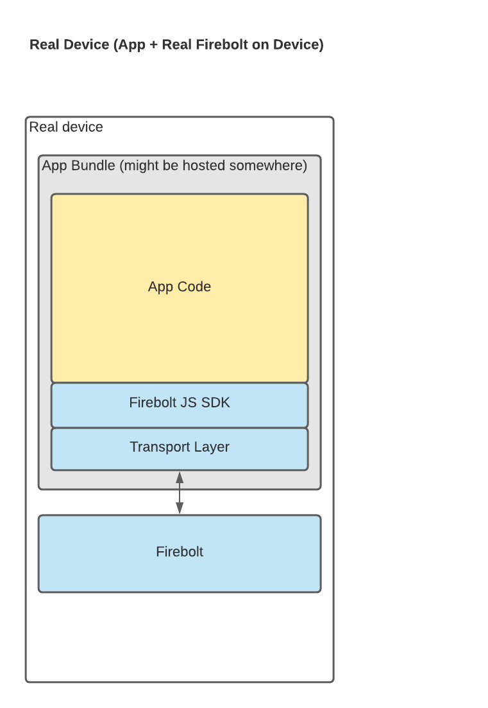
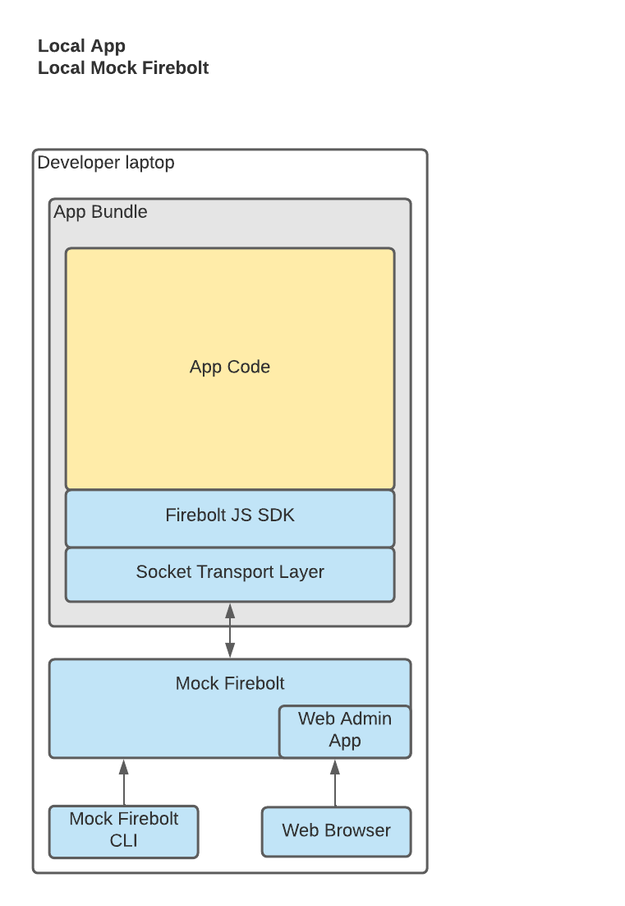
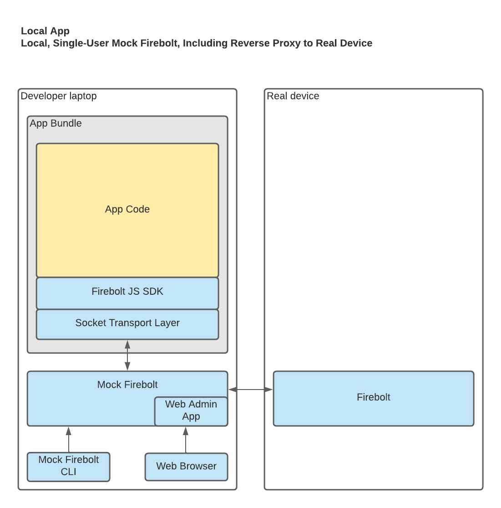

Mock Firebolt: System Configurations
====================================

Mock Firebolt might (eventually) be used in various system configurations, which are described here.

Note that the term "local" here means "on a developer's machine."

Note that "running an app under development locally" means visiting the app on the developer's machine, even if the app is deployed somewhere in the cloud (vs. running the app on a real device).

# System Configurations

## Firebolt on a Real Device (For Reference / Comparison)

NOTES:
- No Mock Firebolt is in use at all. This diagram is only included for comparison / reference purposes.

## 1. Local App, Local Mock Firebolt, No Real Device

NOTES:
- The developer runs the app under development locally on a developer's machine
- The developer runs Mock Firebolt locally on her machine
- No real device is involved

- If the developer wants to use Mock Firebolt's REST API:
  - The developer points HTTP requests at http://localhost:3333/api/v1/...
- If the developer wants to use Mock Firebolt's CLI:
  - The developer runs CLI commands on her machine
  - The default configuration for the CLI is to talk to a local Mock Firebolt, so no special configuration is required
- If the developer wants to use Mock Firebolt's web admin tool:
  - The developer visits http://localhost:3333 in her browser
  - The default configuration for the web admin tool is to talk to a local Mock Firebolt, so no special configuration is required
- If the developer wants to use a Mock Firebolt browser extension:
  - The developer installs the extension in her browser
  - The default configuration for the web extension is to talk to a local Mock Firebolt, so no special configuration is required

## 2. Local App, Deployed/Shared Mock Firebolt, No Real Device

**IMPORTANT NOTE: There are no plans to support a hosted multi-user Mock Firebolt.**

NOTES:
- The developer runs the app under development locally on a developer's machine
- The Mock Firebolt service is running in the Cloud, as a shared service; the developer does not need to run it locally
- No real device is involved

- If the developer wants to use Mock Firebolt's REST API:
  - The developer points HTTP requests at the deployed Mock Firebolt at something like https://somewhere.com/api/v1 (@TODO)
  - The developer's requests must include an HTTP header which identifies them uniquely (@TODO)
- If the developer wants to use Mock Firebolt's CLI:
  - The developer must install the Mock Firebolt repository locally on her machine
  - The developer runs CLI commands on her machine, she just doesn't run the Mock Firebolt server locally
  - The developer must configure the CLI (or pass command line params) so that the CLI can send the appropriate HTTP header when it makes calls to the REST API
- If the developer wants to use Mock Firebolt's web admin tool:
  - The developer visits https://somewhere.com in her browser
  - The developer must "login" so that the admin app can send the appropriate HTTP header when it makes calls to the REST API
- If the developer wants to use a Mock Firebolt browser extension:
  - The developer installs the extension in her browser
  - The developer must "login" so that the extension can send the appropriate HTTP header when it makes calls to the REST API

## 3. Local App, Local Mock Firebolt, With Real Device

NOTES:
- Like #1 above, but:
- The developer can configure Mock Firebolt to act as a reverse proxy for a real device
  - Details @TODO, but presumably providing a web socket URL and token, perhaps after going through some kind of "EasyPair"-esque process.

## 4. Local App, Deployed/Shared Mock Firebolt, With Real Device

- Like #2 above, but:
- The developer can configure Mock Firebolt to act as a reverse proxy for a real device
  - Details @TODO, but presumably providing a web socket URL and token, perhaps after going through some kind of "EasyPair"-esque process.
  - Note: Here, the configuration is being done to a shared Mock Firebolt in the cloud.
